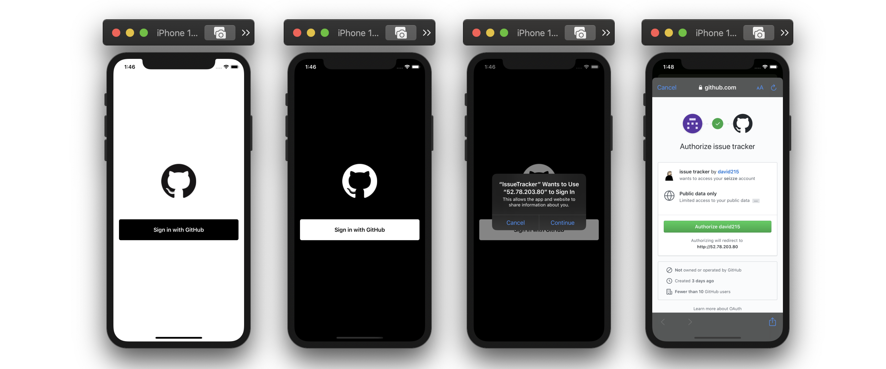

# Issue Tracker iOS

이슈관리 서비스 iOS 앱

## 단계별 구현 내용

### 회원가입 기능 구현

> [PR #12 [Heidi] Sign In with GitHub 구현][pr12]

* Sign In 화면 구성
* 다크모드 지원
* GitHub OAuth를 활용한 회원가입 구현
* GitHubAuthTask 테스트 작성

**실행 결과**

#### 개선한 내용

* 테스트코드 가독성 개선 및 하드코딩 줄임
* 네트워크 에러 alert 추가
* 인증 실패할 경우 에러 핸들링을 위해 Failure handler 추가

### 로그인 유지 기능 구현

> [PR #23 [Heidi] 자동 로그인 기능 구현][pr23]

* Storage 프로토콜과 이를 채택해 UserDefaults에 접근하는 DefaultStorage 구현
* StorageTask 프로토콜과 이를 채택해 User ID를 저장하고 가져오는 LoginStorageTask 구현
* Login Use Case 객체 구현
* 회원가입 후 토큰 저장
* SceneDelegate에서 디바이스에 JWT 토큰이 있을 경우 Dashboard 화면을 보여주고, 없을 경우 Sign In 화면을 보여주도록 구현
* 회원 가입 성공 후 화면 전환 추가
* LoginStorageTask 테스트

### Bottom sheet 구현

> [PR #26 [Heidi] Bottom Sheet 구현][pr26]

* Child 뷰 컨트롤러 추가 및 외형 설정
* Pan 제스쳐를 따라서 뷰 animate
* Pan 제스쳐가 끝나면 접힌 상태/펴진 상태 중 더 가까운 위치로 이동

**실행 결과**

[pr12]: https://github.com/codesquad-member-2020/issue-tracker-11/pull/12
[pr23]: https://github.com/codesquad-member-2020/issue-tracker-11/pull/23
[pr26]: https://github.com/codesquad-member-2020/issue-tracker-11/pull/26

